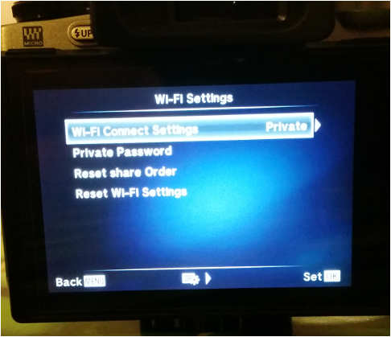
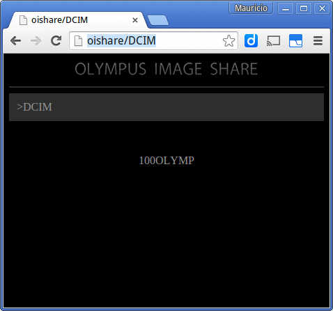

# README

This application allows to download media through WIFI from digital cameras of the series Olympus OMD E-Mx.

Currently this application has only been tested with OMD E-M10 (because the developer owns one). Other similar cameras
such as Olympus OMD E-M1 and E-M5 should work too. If someone is interested in helping me to support them better,
and has such camera, please contact me.

## Get started

### Run the application

This application should run on Windows, Linux and even MacOS.
To transfer media from your camera to your PC follow these steps:

1. Turn on the WIFI service of your camera using `Private` mode in `Wi-Fi Connect Settings`. This step
is **very important**, if not set up correctly the phone won't let this application download media files! To change to `Private` mode go to the menu of your camera, and set `Wi-Fi Connect Settings` to `Private` as shown in the following image.



2. Connect your PC to the WIFI provided by the camera (the SSID of the WIFI network should be something like
"E-M10-V5PG53223").

3. Your PC should be connected to the camera WIFI. To verify such, you can open a web browser (like Explorer,
Chrome, Firefox, etc.) and set as URL either `http://oishare/` or `http://192.168.0.10/`. If browsing any of these URLs
results in a nice dark web page that mentions Olympus somewhere as follows, then you can proceed:



4. Now you can launch the application. You need to keep into account the Operating System you are using:

 - If you are using Linux/MacOS execute `<PHOTOSYNC>/bin/photosync`.

 - If you are using Windows go to `<PHOTOSYNC>\bin` and execute `photosync.bat`.

A console application will launch. It will start copying files from your camera to a local directory. By default,
synchronized media files should be stored in a local directory called `<PHOTOSYNC>/output`.

### Configure

This application uses several parameters to tune the connection with the camera server. To list these parameters you can do: 

- If you are using Linux/MacOS execute `<PHOTOSYNC>/bin/photosync --help`.
- If you are using Windows open a console, do `cd <PHOTOSYNC>\bin` and execute `photosync.bat --help`.

For instance you can run the application using a different camera server name (or IP):

```
photosync[.bat] --server-name 192.168.0.10
```

## Develop

This application is written in Scala and uses SBT. Find below some useful commands for basic actions.

To compile the application do:

```
sbt compile
```

To test the application:

```
sbt test
```

To launch the application:

```
sbt run
```

### Build packages

To build the multi-platform package do the following:

```
sbt universal:packageBin
```

## Contribute

If you want to contribute send me an e-mail to `mauriciojostx@gmail.com` .

If you own a OMD E-MX camera different than E-M10 and want it to be also supported, contact me
by e-mail too, taking only 20 minutes of your time you can help me adapt my application to your camera.
